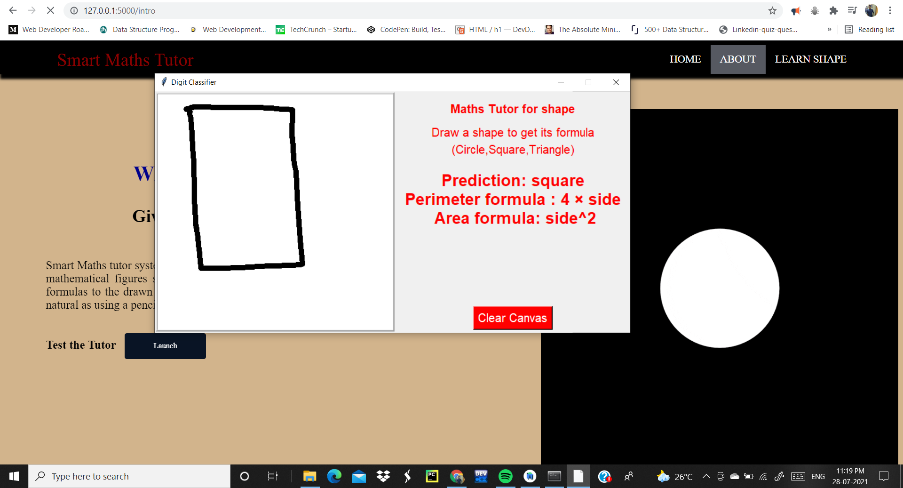

# Smart-Mathematics-Tutor
Smart Maths tutor system is a web based graphical user interface where a user gets to draw shapes of mathematical figures such as square, triangle, circle etc. for which the output would be related formulas to the drawn figure.

