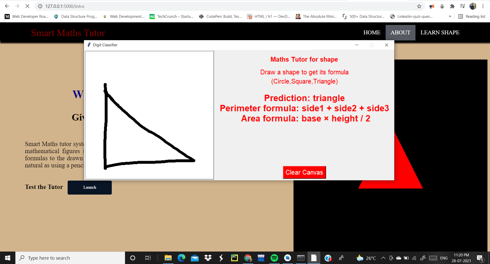
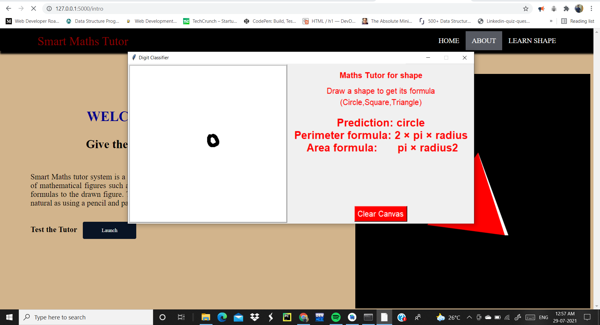
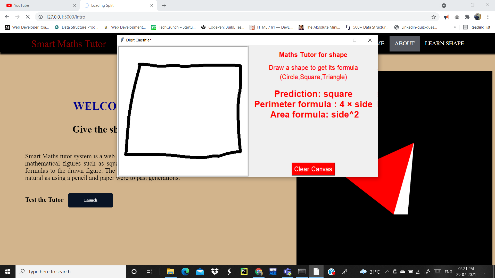

# Smart-Mathematics-Tutor
Smart Maths tutor system is a web based graphical user interface where a user gets to draw shapes of mathematical figures such as square, triangle, circle etc. for which the output would be related formulas to the drawn figure.

# Introduction:
Nationally, the average age at which kids get a phone of their own is 10.3 years. One thing experts agree on is that later is better. Once you open the door, it can be very difficult to close. A 2016 study found that most kids are getting their first social media account between the ages of 10 and 12. Thisich will ultimately lead to unproductive work. Due to lack of interactive learning students doesn't show much interest in learning things. Interactive Learning is a pedagogical approach that incorporates social networking and urban computing into course design and delivery. Interactive Learning has evolved out of the hyper-growth in the use of digital technology and virtual communication, particularly by students. Beginning around 2000, students entering institutes of higher education have expected that interactive learning will be an integral part of their education. The use of interactive technology in learning for these students is as natural as using a pencil and paper were to past generations.

To solve the above mentioned problem we are building a GUI  which helps the students in learning maths and they can easily remember all the formulas. They can draw the shapes in the application which recognizes the shape gives all the related information like list of formulas. This helps the students to learn interactively.

# Link to the dataset
[Shape Dataset](https://drive.google.com/drive/folders/1LB1i53cnWHlmIEnEI2C3gtYALTXX4Awa)

# Link to the Video Demonstration
[Video Demo of the Smart Maths tutor system](https://drive.google.com/file/d/1qCdk6PJr1ud6CnfLHxN1N5tnRLKB62uj/view?usp=sharing)

# Libraries Used
* Tensorflow
* Keras
* FLask
* Numpy
* Matplotlib

# Tools used
* Anaconda Prompt
* Spyder
* Jupyter Notebook
* IBM cloud
* IBM Watson Studio

# Languages used for Website Front-end
* HTML
* CSS

# Role in Team Project
* Neelangshu Nath(Me): Model Building and integration of the model with Flask App at the backend also drawing canvas desinging .

